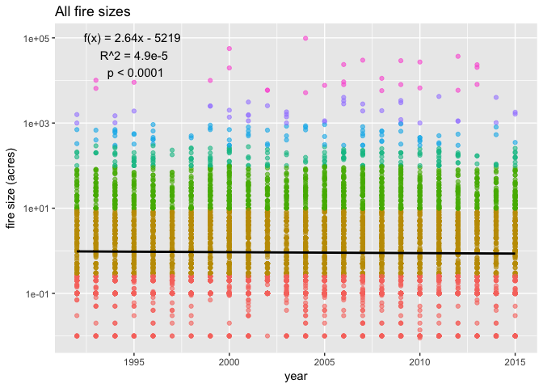
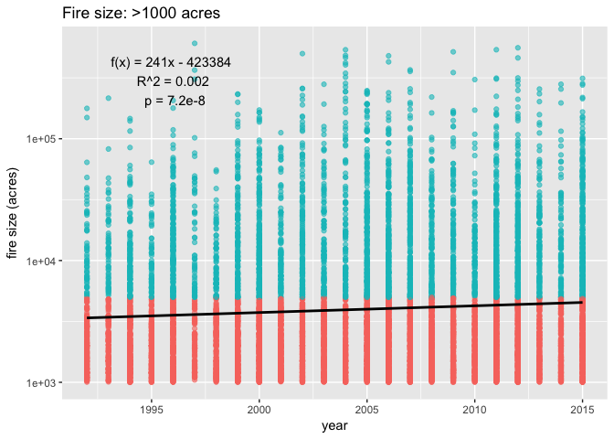
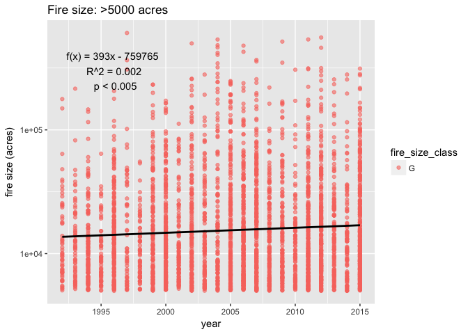
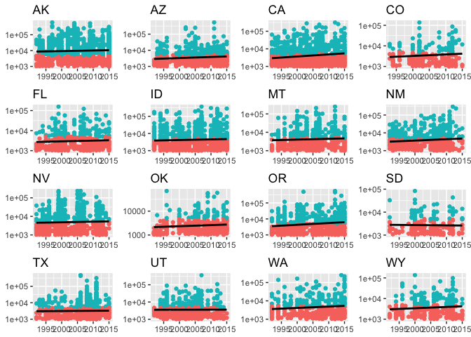
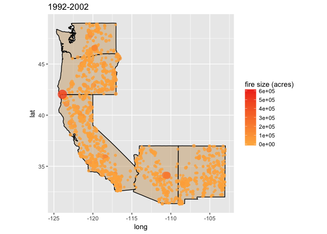
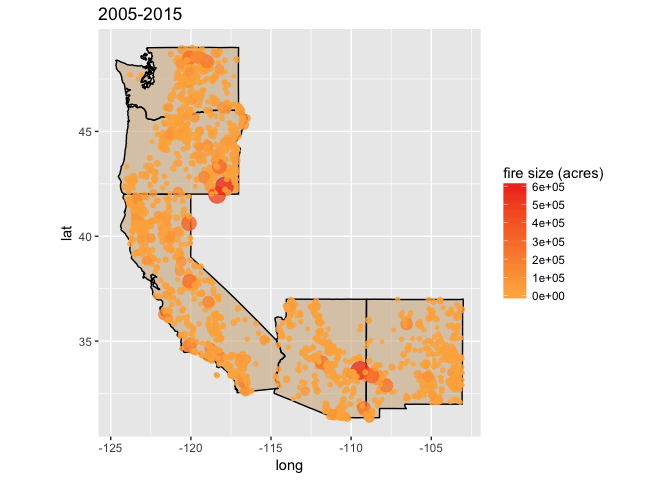

Intro to Data Science - Wildfire dataset
================

December 2017

First we'll load the necessary packages, download the dataset, and cut it down to size.

``` r
library(dplyr)
library(ggplot2)
library(stringr)
library(knitr)
library(data.table)
library(tibble)

# Wildfires between 1992 and 2015
# https://www.kaggle.com/captcalculator/wildfire-exploratory-analysis/data
# library(RSQLite)
# library(dbplyr)
# conn <- dbConnect(SQLite(), '~/Documents/r/math216/FPA_FOD_20170508.sqlite')
# pull the fires table into RAM
# fires <- tbl(conn, "Fires") %>% collect()
# write_csv(fires, '~/Documents/r/math216/fires.csv')
# ff <- read.csv('~/Documents/r/math216/fires.csv')
# print(object.size(ff), units = 'Gb') # 0.9. Way too big! 
# Note how much smaller fire_shortversion.csv is.
# colnames(ff) <- tolower(colnames(ff))
# ff <- ff[,c(2:8,10,12)]
# write_csv(ff, '~/Documents/r/math216/fires_shortversion.csv')

ff <- fread('~/Documents/r/math216/fires_shortversion.csv')
```

    ## 
    Read 60.6% of 1880465 rows
    Read 1880465 rows and 9 (of 9) columns from 0.105 GB file in 00:00:03

``` r
ff$year <- ff$fire_year
```

We'll start by visualizing the frequency of fires by state.

``` r
ff %>%
  ggplot() + 
  geom_bar(aes(reorder(state, state, function(x) - length(x)), fill = fire_size_class )) +
  theme(axis.text.x=element_text(angle=90, hjust=1)) +
  scale_fill_discrete(name = "Fire size class") +
  ggtitle("Wildfires per state") +
  xlab("states")
```


``` r
world <- map_data("world")

ggplot() + 
  geom_map(data=world, map=world, aes(x=long, y=lat, map_id=region), color="white", size=0.05, alpha=1/4) + 
  geom_point(data = sample_n(ff, 10000), aes(longitude, latitude, color = fire_size_class), alpha = .1) +
  coord_quickmap() +
  ylim(10,75) + xlim(-175,-40) +
  guides(color = "none")
```


There seem to be a lot of fires on the west coast as you might expect, but it seems there are also a lot of fires going on in the south. The distribution is somewhat unexpected. This is because we are looking at fires of all sizes. These are what the size classes mean:

| fire size classes (acres) |
|:--------------------------|
| A &lt; 0.25               |
| .25 &lt; B &lt; 10        |
| 10 &lt; C &lt; 100        |
| 100 &lt; D &lt; 300       |
| 300 &lt; E &lt; 1,000     |
| 1,000 &lt; F &lt; 5,000   |
| G &gt; 5,000              |

In fact, most of what is displayed on the two above graphs are fires less than 100 acres (fire size classes A,B, and C). If we look at only the largest fires we see quite a different distribution.

``` r
ff %>%
  filter(fire_size_class %in% c("F","G")) %>%
  ggplot() + geom_bar(aes(reorder(state,state,function(x)-length(x)), fill = fire_size_class), color = "black") +
  theme(axis.text.x=element_text(angle=90, hjust=1)) +
  scale_fill_discrete(name = "Fire size class", labels = c("F (1,000-5,000 acres)", "G (>5,000 acres)")) +
  ggtitle("Wildfires (>1,000 acres) per state ") +
  xlab("state")
```


``` r
ggplot() +
  geom_map(data=world, map=world, aes(x=long, y=lat, map_id=region), color="white", size=0.05, alpha=1/4) +
  geom_point(data = ff[ff$fire_size_class %in% c("F", "G"),], aes(longitude, latitude, color = fire_size_class), alpha = .1) +
  coord_quickmap() +
  ylim(10,75) + xlim(-175,-40) +
  guides(color = "none")
```


It appears that much more of the west is suffering from large wildfires. In particular the Pacific Northwest and Alaska have a lot of fires greater than 5,000 acres.

Next we'll address the question of how wildfires are changing over time. A linear regression will suffice for this.



According to our regression there are 2.6 more wildfires (all sizes) per year and the relationship is very significant. Note the very small r-squared value indicating that less than a percent of the relationship is explained by the regression. Also, graphs of fire size over time use a log scale on the y-axis to better show the distribution.

    ## 
    ## Call:
    ## lm(formula = fire_size ~ year, data = ff[ff$fire_size > 1000, 
    ##     ])
    ## 
    ## Coefficients:
    ## (Intercept)         year  
    ##   -473384.0        241.5



A linear regression applied to all wildfires over 1,000 acres shows that there are 241 more per year and the relationship is highly significant. Also the r-squared value indicates that 0.2% of the data is explained by the regression.

    ## 
    ## Call:
    ## lm(formula = fire_size ~ year, data = ff[ff$fire_size > 5000, 
    ##     ])
    ## 
    ## Coefficients:
    ## (Intercept)         year  
    ##   -759764.9        392.8



A linear regression applied to all wildfires over 5,000 acres indicates there are almost 400 more per year. The relationship is quite significant but only 0.2% of the data are explained by the regression.



| state |  slope|  p value|  r squared|
|:------|------:|--------:|----------:|
| CA    |    418|   0.0001|     0.0130|
| NM    |    403|   0.0003|     0.0193|
| WA    |    461|   0.0200|     0.0142|
| OR    |    519|   0.0296|     0.0079|
| CO    |    278|   0.0848|     0.0136|
| ID    |    219|   0.1149|     0.0023|
| UT    |    186|   0.2015|     0.0033|
| MT    |    169|   0.2320|     0.0024|
| AZ    |    213|   0.2535|     0.0023|
| WY    |    128|   0.3111|     0.0034|
| OK    |     49|   0.3620|     0.0017|
| NV    |    128|   0.4501|     0.0008|
| FL    |     64|   0.4862|     0.0010|
| TX    |    137|   0.4951|     0.0005|
| AK    |   -185|   0.4978|     0.0004|
| SD    |    -46|   0.6048|     0.0011|

Applying a linear regression to wildfires over 1,000 acres in the 16 states with the most large fires reveals that in only two states is the relationship highly significant (p &lt; 0.001): California and New Mexico. In both states there are more than 400 more wildires per year and more than 1% of the data is explained by the regression.



When we map the largest fires (&gt;1000 acres) in the West we can actually see the differences between the former and latter decades of the study period.

This last analysis was pretty experimental. I began by downloading raster maps (maps made of pixels rather than polygons) of the average yearly maximum temperature for the US from 1992 to 2015. For each wildfire I averaged the temperatures from the cells immediately surrounding the point based on coordinates. Averages were based on 4 to 9 neighboring cells. I captured neighboring cells simply by rounding the coordinates of the wildfire site and the neighboring sites and using matching data points.

#### References

Short, Karen C. 2017. Spatial wildfire occurrence data for the United States, 1992-2015 \[FPA\_FOD\_20170508\]. 4th Edition. Fort Collins, CO: Forest Service Research Data Archive. <https://doi.org/10.2737/RDS-2013-0009.4>
