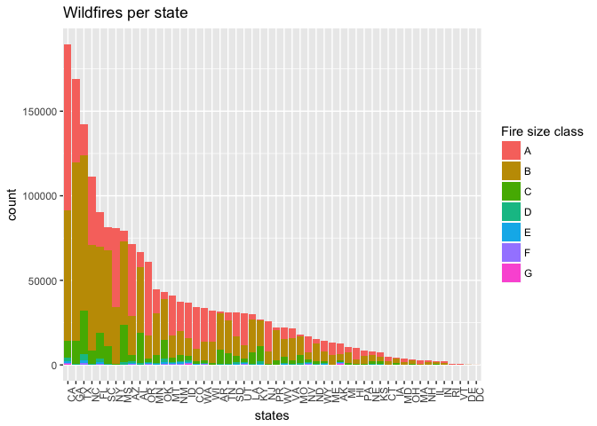
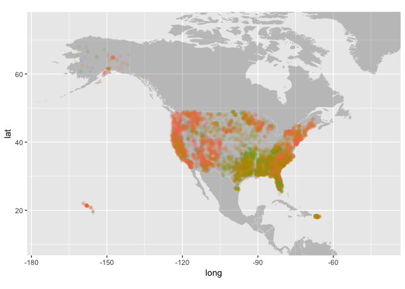
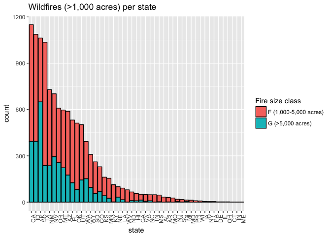
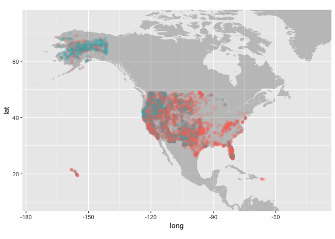

Intro to Data Science - Wildfire dataset
================

Elias M Guerra

December 2017

First we'll load the necessary packages, download the dataset, and cut it down to size.

``` r
library(dplyr)
library(ggplot2)
library(stringr)
library(knitr)
library(data.table)

# Wildfires between 1992 and 2015
# https://www.kaggle.com/captcalculator/wildfire-exploratory-analysis/data
# library(RSQLite)
# library(dbplyr)
# conn <- dbConnect(SQLite(), '~/Documents/r/math216/FPA_FOD_20170508.sqlite')
# pull the fires table into RAM
# fires <- tbl(conn, "Fires") %>% collect()
# write_csv(fires, '~/Documents/r/math216/fires.csv')
# ff <- read.csv('~/Documents/r/math216/fires.csv')
# print(object.size(ff), units = 'Gb') # 0.9. Way too big! 
# Note how much smaller fire_shortversion.csv is.
# colnames(ff) <- tolower(colnames(ff))
# ff <- ff[,c(2:8,10,12)]
# write_csv(ff, '~/Documents/r/math216/fires_shortversion.csv')

ff <- fread('~/Documents/r/math216/fires_shortversion.csv')
```

    ## 
    Read 74.4% of 1880465 rows
    Read 1880465 rows and 9 (of 9) columns from 0.105 GB file in 00:00:03

``` r
ff$year <- ff$fire_year
```

We'll start by visualizing the frequency of fires by state.

``` r
ff %>%
  ggplot() + 
  geom_bar(aes(reorder(state, state, function(x) - length(x)), fill = fire_size_class )) +
  theme(axis.text.x=element_text(angle=90, hjust=1)) +
  scale_fill_discrete(name = "Fire size class") +
  ggtitle("Wildfires per state") +
  xlab("states")
```



``` r
world <- map_data("world")

ggplot() + 
  geom_map(data=world, map=world, aes(x=long, y=lat, map_id=region), color="white", size=0.05, alpha=1/4) + 
  geom_point(data = sample_n(ff, 10000), aes(longitude, latitude, color = fire_size_class), alpha = .1) +
  coord_quickmap() +
  ylim(10,75) + xlim(-175,-40) +
  guides(color = "none")
```



There seem to be a lot of fires on the west coast as you might expect, but it seems there are also a lot of fires going on in the south. The distribution is somewhat unexpected. This is because we are looking at fires of all sizes. These are what the size classes mean:

| fire size classes (acres) |
|:--------------------------|
| A &lt; 0.25               |
| .25 &lt; B &lt; 10        |
| 10 &lt; C &lt; 100        |
| 100 &lt; D &lt; 300       |
| 300 &lt; E &lt; 1,000     |
| 1,000 &lt; F &lt; 5,000   |
| G &gt; 5,000              |

In fact, most of what is displayed on the two above graphs are fires less than 100 acres (fire size classes A,B, and C). If we look at only the largest fires we see quite a different distribution.

``` r
ff %>%
  filter(fire_size_class %in% c("F","G")) %>%
  ggplot() + geom_bar(aes(reorder(state,state,function(x)-length(x)), fill = fire_size_class), color = "black") +
  theme(axis.text.x=element_text(angle=90, hjust=1)) +
  scale_fill_discrete(name = "Fire size class", labels = c("F (1,000-5,000 acres)", "G (>5,000 acres)")) +
  ggtitle("Wildfires (>1,000 acres) per state ") +
  xlab("state")
```



``` r
ggplot() +
  geom_map(data=world, map=world, aes(x=long, y=lat, map_id=region), color="white", size=0.05, alpha=1/4) +
  geom_point(data = ff[ff$fire_size_class %in% c("F", "G"),], aes(longitude, latitude, color = fire_size_class), alpha = .1) +
  ylim(10,75) + xlim(-175,-40) +
  coord_quickmap() +
  guides(color = "none")
```



#### References

Short, Karen C. 2017. Spatial wildfire occurrence data for the United States, 1992-2015 \[FPA\_FOD\_20170508\]. 4th Edition. Fort Collins, CO: Forest Service Research Data Archive. <https://doi.org/10.2737/RDS-2013-0009.4>
