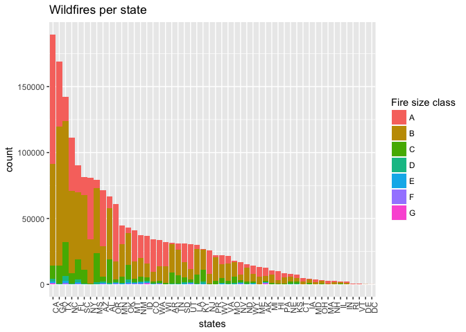

Intro to Data Science - Wildfires dataset exploratory analysis
================
Elias M Guerra
3/19/2018

``` r
library(tidyverse)
library(stringr)
library(knitr)
library(data.table)
xlab_horiz <- theme(axis.text.x=element_text(angle=90, hjust=1))

ff <- fread('~/Documents/r/math216/fires_shortversion.csv', stringsAsFactors = F)
```

    ## 
    Read 48.4% of 1880465 rows
    Read 93.1% of 1880465 rows
    Read 1880465 rows and 9 (of 9) columns from 0.105 GB file in 00:00:04

``` r
ff$year <- ff$fire_year

ff %>% ggplot() + geom_bar(aes(reorder(state,state,function(x)-length(x)), fill = fire_size_class)) + 
  xlab_horiz +
  scale_fill_discrete(name = "Fire size class" ) +
  ggtitle("Wildfires per state") +
  xlab("states")
```



``` r
world <- map_data("world")
```
